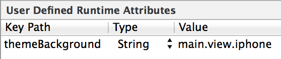

DZLThemer
=========

This project is explained in more detail in [this blog post](http://samdods.github.io/blog/2014/07/26/theming/).

Adds support for user defined runtime attributes to be set in Interface Builder, which will correspond to values in a theme plist.



In the example above, setting the key `themeBackground` with the value `main.view.iphone` requires the theme dictionary to contain the following key path to the `bgColorHex` key:

```json
{
  "main" : {
    "view" : {
      "iphone" : {
        "bgColorHex" : "a3fe00"
      }
    }
  }
}
```

By configuring in a plist the aesthetic properties of my interface elements, I can easily swap in a new plist to completely change the look and feel of the entire app.

And by setting the reference "key" in Interface Builder, I keep the code completely clutter-free of interface configuration code.

# Setup

Simply add the files from the `DZLThemer` directory into your project and create a theme dictionary in a plist file.

In `-application:didFinishLaunchingWithOptions:` method in your app delegate, you must tell the DZLThemer the name of your plist file, as follows:

```objc
[DZLThemer shared].plistFileName = @"DarkTheme"; // example file name
```

> Note, it's more likely for this filename to come from the build settings. It could be configured as a GCC Preprocessor Macro or otherwise injected into the build.

# UIKit elements supported

## UIView

User defined runtime attribute `themeBackground` requires the following keys defined at key path:

* `bgColorHex` - must be a string of hex digits, 6 or 8 characters long, e.g. 00a2ff or 0x11ffe1e9

## UILabel

User defined runtime attribute `themeText` requires the following keys defined at key path:

* `fontName` - must be the name of a valid font
* `fontSize` - must be a number
* `lineSpacing` - must be a number
* `colorHex` - must be a string of hex digits, 6 or 8 characters long, e.g. 00a2ff or 0x11ffe1e9

## UIButton

User defined runtime attribute `themeText` requires the following keys defined at key path:

* `fontName` - must be the name of a valid font
* `fontSize` - must be a number
* `colorHex` - must be a string of hex digits, 6 or 8 characters long, e.g. 00a2ff or 0x11ffe1e9


